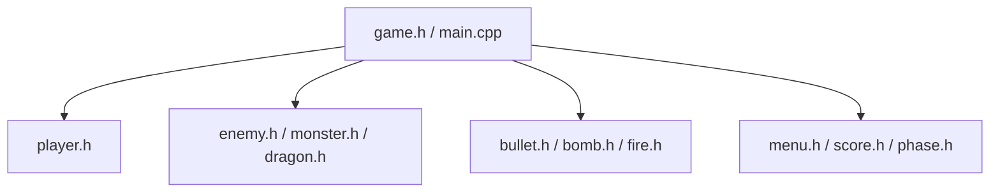

# Space Shooter

> **A modern, fast-paced recreation of the classic arcade space shooter, built from scratch using C++ and SFML.**

---

## Overview

**Space Shooter** is a retro-style 2D arcade game built in C++ utilizing the **Simple and Fast Multimedia Library (SFML)**. The project serves as both an entertaining game and a robust demonstration of applying Object-Oriented Programming (OOP) design patterns—such as inheritance, encapsulation, and polymorphism—within a real-world game development scenario.

## Features

- [x] **Smooth 2D Gameplay:** Fluid movement and high framerate rendering powered by SFML.
- [x] **Player Combat Mechanics:** Responsive spaceship controls and satisfying shooting mechanics.
- [x] **Dynamic Enemy Waves:** Progressively difficult enemy spawning and wave progression systems.
- [x] **Collision & Physics:** Pixel-perfect bounding box collision detection between entities, projectiles, and the player.
- [x] **Score & Progression:** Built-in scoring system with power-ups, extra lives, and high score tracking.
- [x] **Modular Architecture:** Cleanly separated OOP classes (`Player`, `Enemy`, `Bullet`, etc.) making the codebase highly extensible for new entity types.

---

## Architecture

The game is heavily modularized into entity-specific header and implementation files:



---

## Build Instructions

This project requires a C++ compiler (e.g., `g++` via MinGW) and the **SFML 2.5.1** library.

### Windows Compilation

Assuming SFML is extracted to `C:\SFML-2.5.1\`, use the following commands to compile and link the executable:

```bash
# 1. Compile the object file
g++ -IC:\SFML-2.5.1\include -c main.cpp -o game.o 

# 2. Link the SFML libraries to create the executable
g++ -LC:\SFML-2.5.1\lib .\game.o -o game.exe -lmingw32 -lsfml-graphics -lsfml-window -lsfml-system -lsfml-main -mwindows
```

### Linux / macOS Compilation

Ensure you have installed SFML development headers (e.g., `sudo apt install libsfml-dev` on Ubuntu or `brew install sfml` on macOS).

```bash
# Compile and Link
g++ -c main.cpp
g++ main.o -o sfml-app -lsfml-graphics -lsfml-window -lsfml-system

# Run the application
./sfml-app
```

---

## How to Play

1. Run the compiled executable (`game.exe` on Windows or `./sfml-app` on Linux/macOS).
2. **Movement:** Use the `Arrow Keys` or `W/A/S/D` to navigate your spaceship.
3. **Action:** Press `Spacebar` to fire bullets at incoming enemies.
4. **Objective:** Survive as many waves as possible, gather score points, and dodge enemy projectiles!

---

## Code Structure Highlights

| File Type | Examples | Description |
| :--- | :--- | :--- |
| **Entities** | `player.h`, `enemy.h`, `dragon.h`, `monster.h` | Core classes representing game actors. |
| **Projectiles** | `bullet.h`, `bomb.h`, `fire.h` | Various weapon and projectile types. |
| **Management** | `game.h`, `menu.h`, `phase.h` | Game state, main loops, and rendering logic. |
| **Assets** | `SPACE.ttf` | Custom typography used in menus and HUDs. |
| **Data** | `scores.txt` | Persistent local high-score tracking. |

---

## Contributing
Contributions, bug reports, and pull requests are welcome. This project is meant to be highly educational for developers learning game loops, physics integration, and C++ SFML interactions.
